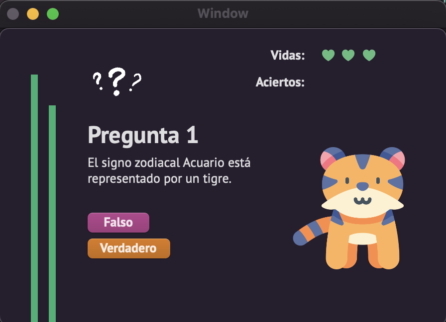
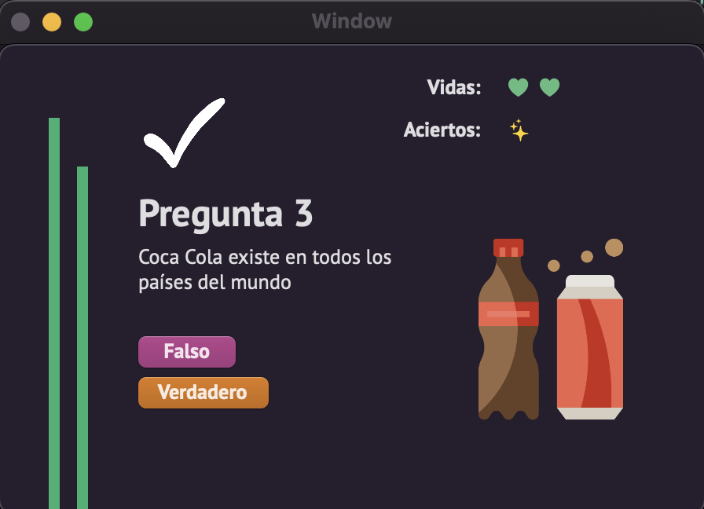
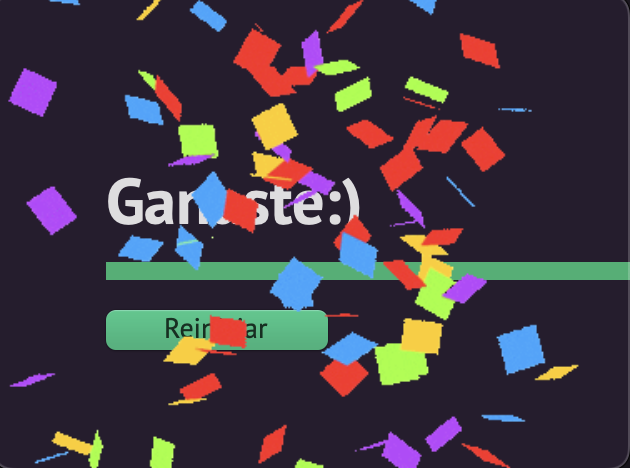
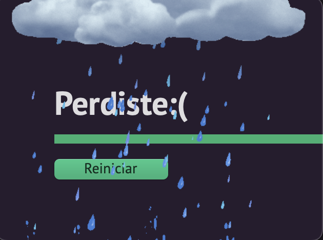

# Juego de verdadero o falso
Consiste de 3 nivel (básico, intermedio y avanzado), depende del nivel cambia la cantidad de aciertos para ganar y las vidas otorgadas. 

Proyecto en swift para Mac

### Capturas de pantalla:

